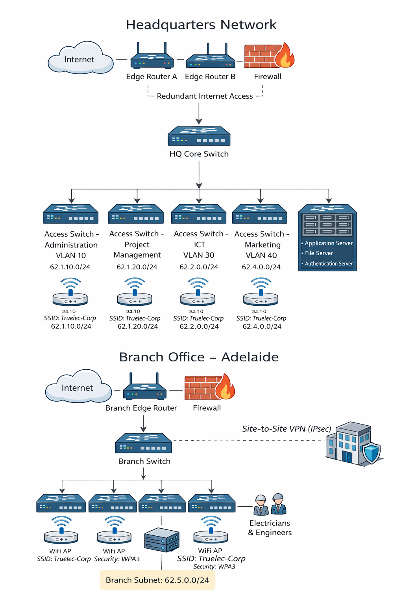
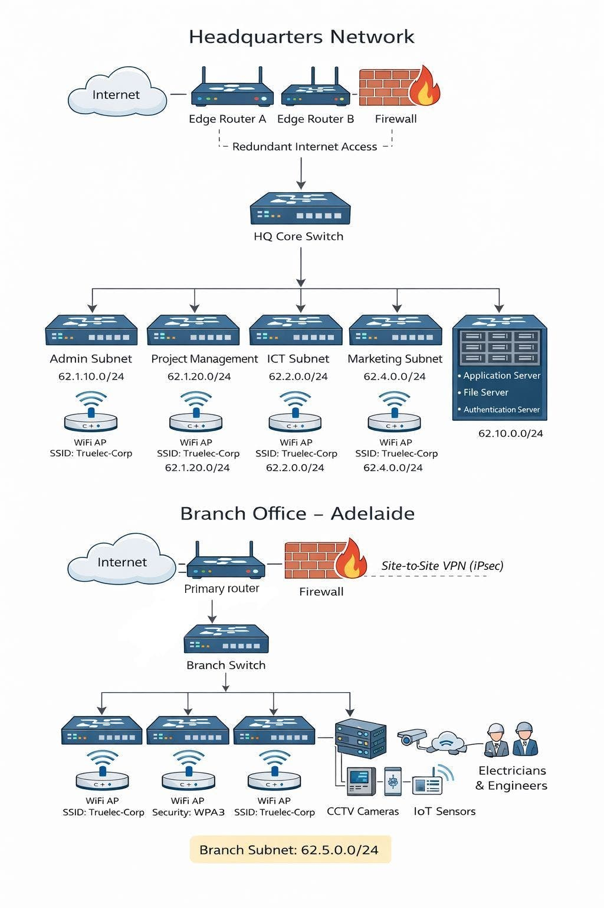

# Network Design

## 1. Assumptions
The project scenario does not specify all operational and technical details. The following assumptions were made to support the proposed network design.

1. The headquarters of Truelec is assumed to be located in Melbourne, Australia.
2. The organisation operates multiple branch offices across Australia, and the branch office designed in this project is located in Adelaide.
3. The headquarters is assumed to support approximately 65 staff members.
4. The Adelaide branch office is assumed to support approximately 20 staff members.
5. Both headquarters and branch offices require wired and wireless network access.
6. Secure communication between headquarters and branch offices is required over the public internet.

## 2. Design Goals
The proposed network design aims to meet the current and future operational needs of Truelec. The key design goals are as follows:

- Provide a secure network infrastructure to protect organisational data and systems.
- Ensure reliable connectivity for all staff at headquarters and branch offices.
- Support both wired and wireless access for flexibility and mobility.
- Allow for future growth without major redesign of the network.
- Maintain a simple and manageable network structure using industry best practices.

## 3. Headquarters Network Design

### 3.1 Overview
The headquarters network is designed for the Melbourne office, which serves as the central administrative and operational hub for Truelec. This site hosts critical business systems and provides services to all branch offices.

A hierarchical network architecture is used, consisting of edge, core, and access layers. This design improves scalability, simplifies network management, and allows faults to be isolated more easily.

The headquarters network is designed to support a large number of users, internal servers, and secure connectivity to branch offices while maintaining strong security controls.

### 3.2 Network Diagram

### 3.3 Core Components and Design Decisions
The headquarters network includes several core components to ensure security, performance, and reliability.

Two edge routers are deployed to provide redundant internet connectivity. This reduces the risk of complete network outage if one router fails.

A dedicated firewall is positioned between the edge routers and the internal network. The firewall enforces security policies, filters malicious traffic, and protects internal systems from external threats.

The HQ core switch acts as the central switching and routing device within the headquarters network. It supports inter-subnet routing and connects all access switches and servers.

Departmental access switches connect end-user devices within each department. Logical separation of departments is achieved through the use of dedicated IP subnets, which improves security and reduces unnecessary broadcast traffic.

Business-critical servers, including application, file, and authentication servers, are hosted in a dedicated server segment to allow stronger security controls and improved performance.

A site-to-site VPN is implemented between the headquarters and branch office firewalls to provide secure encrypted communication over the public internet.

## 4. Branch Office Network Design

### 4.1 Overview
The Adelaide branch office network is designed to support a smaller number of staff while maintaining the same security principles used at headquarters.

The branch office uses a simplified architecture consisting of an edge router, firewall, access switch, and wireless access points. Secure connectivity to the headquarters network is provided using a site-to-site VPN.

### 4.2 Network Diagram

### 4.3 Branch Network Components
The branch office network includes a branch edge router and firewall to provide secure internet access and protect internal devices.

A branch switch connects wired devices such as desktop computers and local servers. Wireless access points provide WiFi connectivity for mobile devices and operational staff.

All traffic between the branch office and headquarters is encrypted using a site-to-site VPN, ensuring data confidentiality and integrity.

Redundancy is incorporated into the branch office design through an alternative WAN connection. This ensures the branch remains connected to headquarters in the event of a primary link or router failure.

The branch office network also supports operational and security technologies, including CCTV cameras, IoT sensors, and RFID-based access control systems. These devices are connected to the internal network to enable site monitoring, asset tracking, and secure access management.

## 5. IP Addressing Plan
The IP addressing scheme follows the project requirements by using only /16 and /24 subnet masks. The first octet of all IP addresses corresponds to the last two digits of the student ID (62).

### Headquarters Subnets

| Department | Subnet |
|----------|--------|
| Administration | 62.1.10.0/24 |
| Project Management | 62.1.20.0/24 |
| ICT | 62.2.0.0/24 |
| Marketing | 62.4.0.0/24 |
| Servers | 62.10.0.0/24 |

### Branch Office Subnet

| Location | Subnet |
|--------|--------|
| Adelaide Branch | 62.5.0.0/24 |

## 6. WiFi Design
Wireless connectivity is provided at both headquarters and branch offices to support mobile devices and operational requirements.

The corporate wireless network uses a single SSID, "Truelec-Corp", secured using WPA3-Enterprise authentication. WiFi 6 (802.11ax) access points are deployed to provide high performance, reliability, and support for modern devices.

## 7. Hardware Recommendations
The proposed network design uses enterprise-grade hardware to ensure performance, reliability, and security.

| Device | Purpose | Approx. Cost (AUD) |
|------|--------|------------------|
| Edge Router | Internet and WAN connectivity | $3,000 |
| Firewall | Network security and VPN | $5,000 |
| Core Switch | Central switching and routing | $4,000 |
| Access Switch | End-user connectivity | $1,500 |
| Wireless AP | Secure wireless access | $800 |

## 8. Summary
The proposed network design provides Truelec with a secure, scalable, and resilient infrastructure that meets operational requirements and supports future growth.

By incorporating redundancy, secure WAN connectivity, subnet segmentation, and support for IoT and security systems, the design aligns closely with the project brief and industry best practices.
